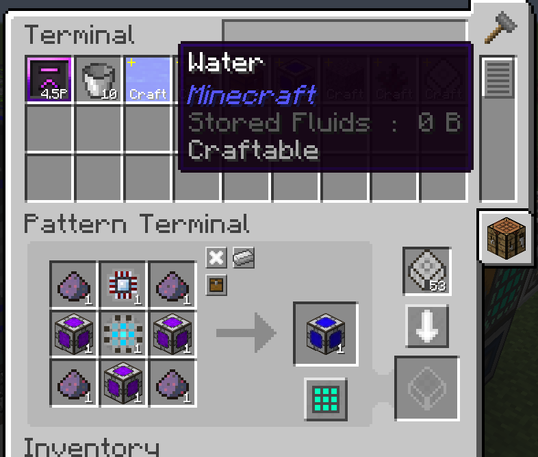
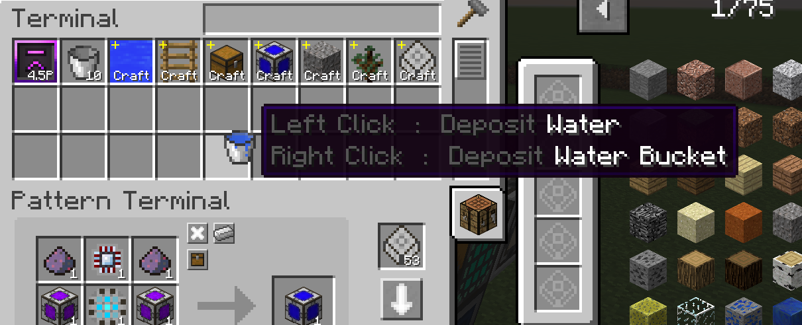

# AE2 Fluid Crafting Rework - Unofficial

Put fluids in the pattern!

AE2 autocrafting is amazing and everyone loves it, but it is always becoming painful when dealing with fluids. You have to put fluids in a container or use a dummy item to write patterns with fluids.

That's because AE2 doesn't support fluid as valid crafting ingredients before 1.16, so it can't handle fluids directly.

However, it is changed now! With **AE2 Fluid Crafting** you can write patterns with fluids freely. Your AE system can output and accept fluids like items without worrying about how to handle these fluid cells.

This is a rework and ported version of [ae2-fluid-crafting](https://github.com/phantamanta44/ae2-fluid-crafting)

Additional extensions based on [AE2 Fluid Craft-Rework](https://github.com/AE2-UEL/AE2FluidCraft-Rework?tab=readme-ov-file)

## Features
Everything is based on https://github.com/AE2-UEL/AE2FluidCraft-Rework?tab=readme-ov-file ,but some more usable modifications have been made

  - No longer need the ME Fluid Discretizer!
  - Now Fluid Drop appears in your terminal in a more elegant way—I mean, as shown in the image below.
  - You can no longer take Fluid Drop directly from the terminal, but you can interact with it using a container, just like in the fluid terminal.
  - Work with the original Pattern Terminal instead of the Fluid Pattern Terminal, but you can still use the Fluid Pattern Terminal from old saves.

## Installation

### 1.12.2
Unofficial AE2([PAE2](https://www.curseforge.com/minecraft/mc-mods/ae2-extended-life)).

You can directly upgrade origin AE2FC2 in your old save.

Official AE2 isn't supported, you can use origin [AE2FC](https://github.com/phantamanta44/ae2-fluid-crafting) if you are playing with Official AE2.

## Credited Works

E. Geng(@phantamanta44) and KilaBash (@Yefancy) - Their amazing origin work in 1.12.
@GlodBlock - Improvements to this mod and support for MEK projects

## Some Content Display

